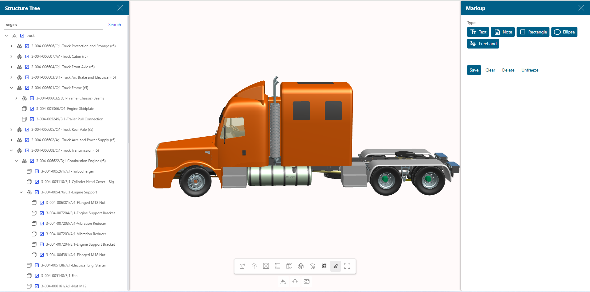
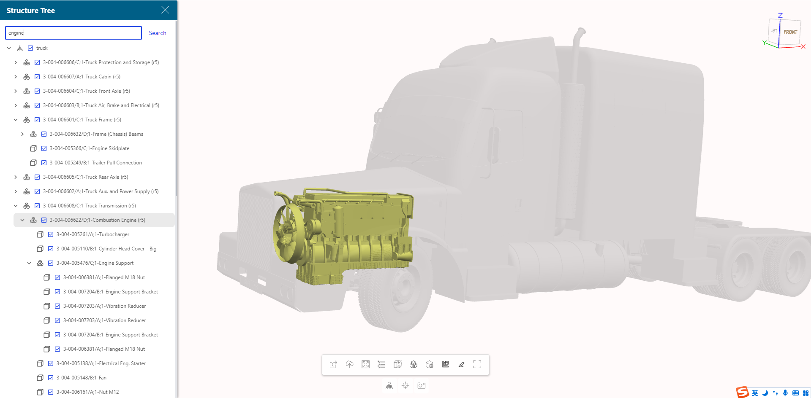
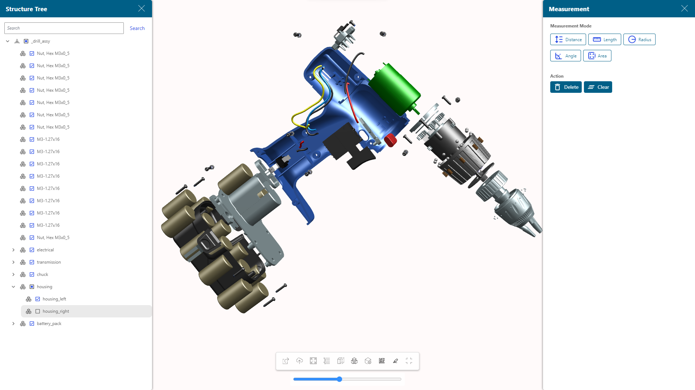
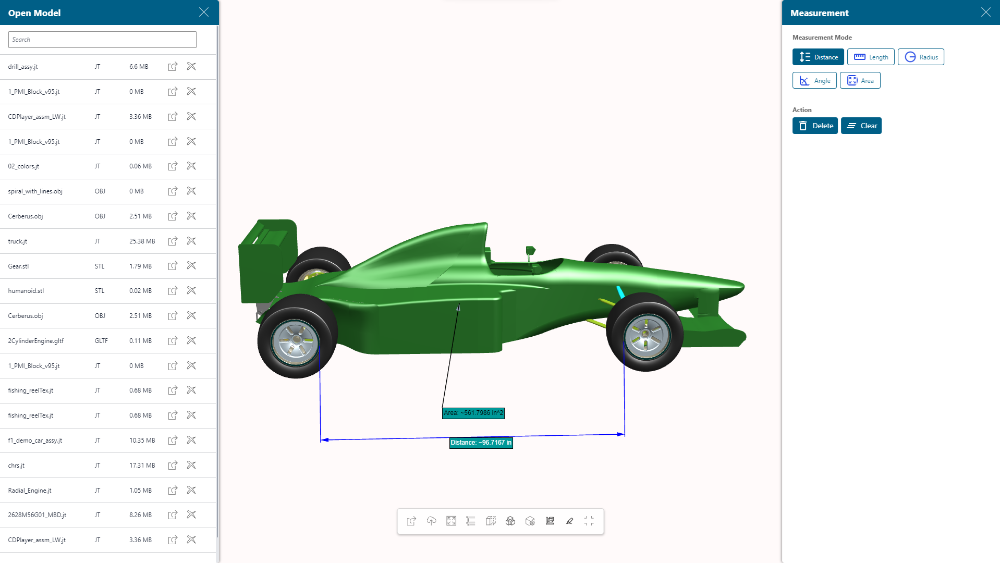

### How to run
- git clone --depth=1 https://github.com/franksoong/3DViewerIntroductionApp.git
- open and run with Mendix Visual Studio 10.0.0 or above

### Demo
- quick demo

- snapshots

### Trouble shootings
- any technical questions please send mail to group 3dviewer_mendix_wc.sisw@siemens.com
